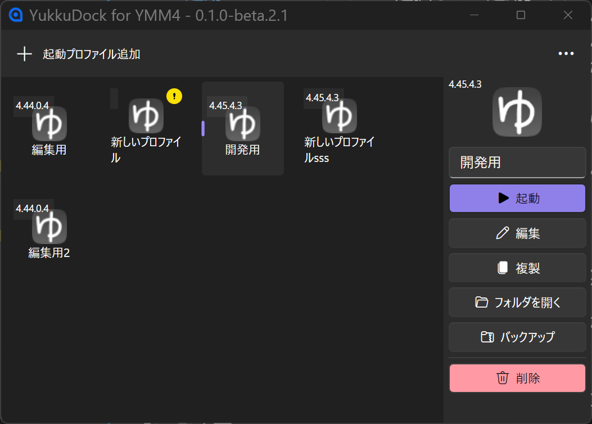
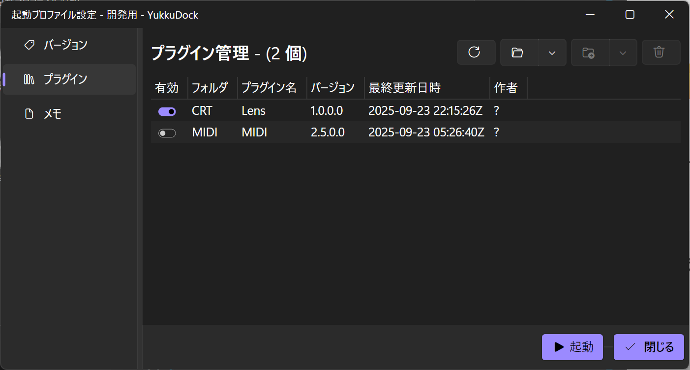

# YukkuDock for YMM4

<p align="center" style="background-color:lightblue;padding:2em 0px;">
	
	<br />
	<strong style="font-family:sans-serif;font-size:2em;color:#03763e;text-shadow:0 0 2px #000;">YukkuDock</strong>
    <br />
    <em style="font-family:sans-serif;color:#03763e;text-shadow:0 0 2px #000;">for YMM4</em>
</p>


[](LICENSE)  [](https://avaloniaui.net/)  [](https://github.com/kekyo/Epoxy)
  

**YukkuDock for YMM4で、より効率的な動画制作を！** 🎬✨

「**YukkuDock for YMM4**」（**ゆっくドック**）は、YMM4（ゆっくりMovieMaker4）ユーザーのための多機能ランチャー＆管理アプリです。

## 🚀 概要

YukkuDockは、YMM4をもっと便利に使うためのアプリケーションです。

### こんな方におすすめ

- 複数のYMM4を使い分けたい方
- プラグインの管理に困っている方
- 設定やデータのバックアップを自動化したい方
- プロジェクトごとに違う環境で作業したい方

### YukkuDockでできること

- **複数のYMM4を簡単切り替え**
  異なるバージョンのYMM4や、インストール場所の違うYMM4をワンクリックで起動できます

- **起動プロファイル機能**
  プロジェクトや用途ごとに設定をまとめて管理。「実況用」「解説動画用」など、用途別の環境をすぐに呼び出せます

- **YMM4のプラグイン管理が楽に**
  YMM4プラグインの有効・無効をトグルスイッチで簡単切り替え。不要なプラグインも安全に削除できます

- **自動バックアップ機能（※予定）**
  大切な設定やデータを自動的にバックアップ。万が一の時も安心です

### 主な機能

- 📋 **起動プロファイル管理**: 複数のYMM4環境を個別に管理
- 🚀 **ワンクリック起動**: 設定済み起動プロファイルでYMM4を即座に起動
- 🔌 **プラグイン管理**: プラグインの有効/無効切り替え、バックアップ・復元
<!--
- 🎨 **レイアウト管理**: UIレイアウトの保存・切り替え
- 📝 **アイテムテンプレート管理**: よく使うアイテム設定の保存・適用
- 🗣️ **音声キャラクター管理**: 音声設定の一括管理
 -->
- 💾 **バックアップ**: 設定の保存

## 📸 スクリーンショット

<!-- TODO: スクリーンショットを追加 -->


## 📦 インストール

### システム要件

- Windows 10 1809以降 / Windows 11
- .NET 9.0 Runtime
- YMM4 (ゆっくりMovieMaker4)
  - YukkuDock自体のインストールには不要ですが、立ち上げには必要になります。

### インストール手順

1. [Releases](https://github.com/InuInu2022/YukkuDock/releases)から最新版をダウンロード
2. ダウンロードしたzipファイルを任意のフォルダに展開
3. `YukkuDock.Desktop.exe`を実行

## 🚀 使い方

### 初回セットアップ

1. YukkuDockを起動
2. 「起動プロファイル追加」ボタンをクリック
3. プロファイル名をつける
4. 編集ボタンを押して起動プロファイル設定ウィンドウを開く
5. YMM4の実行ファイルパスを設定
6. 「閉じる」をクリックして完了

### 起動プロファイル管理


- **新規作成**: 「起動プロファイル追加」ボタンでプロファイル作成
- **起動**: プロファイルを選択して「起動」ボタンでYMM4を起動
- **編集**: プロファイルを選択して「編集」ボタンで設定変更
- **複製**: プロファイルを選択して「複製」ボタンで同設定のプロファイルをコピー
- **フォルダを開く**: プロファイルを選択して「フォルダを開く」ボタンでプロファイルのフォルダをエクスプローラーで開く
- **バックアップ**: プロファイルを選択して「バックアップ」ボタンでバックアップを作成
- **削除**: プロファイルを選択して「削除」ボタンで削除

### プラグイン管理



起動プロファイル設定ウィンドウの「プラグイン」タブから、YMM4プラグインの管理ができます。

- **プラグイン一覧表示**: 選択中のプロファイルに関連付けられたYMM4のプラグインを一覧表示
- **有効/無効切り替え**: トグルスイッチでプラグインの有効/無効を切り替え
- **情報更新**: 「更新」ボタンでプラグイン情報を最新の状態に更新
- **プラグインフォルダ開く**: プラグインフォルダを開く
- **バックアップ**: プラグインを丸ごとバックアップ
- **プラグイン削除**: 不要なプラグインを削除

### バックアップ・復元

- **プロファイルバックアップ**: プロファイル全体のバックアップ作成
- **個別バックアップ**: プラグインなどの個別バックアップ

## 📁 データ保存場所

YukkuDockのデータは以下の場所に保存されます：

```cmd
%APPDATA%\YukkuDock\
├── Profiles\
│   ├── {GUID}\
│   │   ├── profile.json
│   │   └── PluginPacks\
├── Backup\
│   └── {GUID}\
│       ├── 2024-01-01_12-00-00.zip
│       └── ...
```

バックアップしたプロファイルは`Profiles`以下に展開することで復元できます。

## 🔧 開発者向け情報

### 技術スタック

- **.NET 9.0**: メインフレームワーク
- **Avalonia UI**: クロスプラットフォームUIフレームワーク
- **FluentAvalonia**: Fluent Design風UIコンポーネント
- **Epoxy**: MVVMフレームワーク
- **Projektanker.Icons.Avalonia**: アイコン管理

### ビルド方法

```bash
# リポジトリをクローン
git clone https://github.com/InuInu2022/YukkuDock.git
cd YukkuDock

# 依存関係の復元
dotnet restore

# デバッグビルド
dotnet build

# リリースビルド
dotnet build --configuration Release

# アプリケーションの実行
dotnet run --project src/YukkuDock.Desktop
```

### プロジェクト構造

```cmd
src/
├── YukkuDock.Core/          # コアロジック・ドメインモデル
├── YukkuDock.Desktop/       # Avalonia UI アプリケーション
└── YukkuDock.Core.Win/      # Windows固有機能
```

### 主要なクラス

- `Profile`: プロファイル情報の管理
- `PluginPack`: プラグインパックの管理
- `Layout`: レイアウト設定の管理
- `ItemTemplate`: アイテムテンプレートの管理
- `VoiceCharacter`: 音声キャラクター設定の管理

## 🤝 コントリビューション

プルリクエストやイシューの報告を歓迎します！

1. このリポジトリをフォーク
2. フィーチャーブランチを作成 (`git checkout -b feature/AmazingFeature`)
3. 変更をコミット (`git commit -m 'Add some AmazingFeature'`)
4. ブランチにプッシュ (`git push origin feature/AmazingFeature`)
5. プルリクエストを作成

### 開発ガイドライン

- コードスタイルは既存のコードに合わせてください
- 新機能には適切なテストを追加してください
- コミットメッセージは[Conventional Commits](https://www.conventionalcommits.org/)に従ってください

## 📄 ライセンス

このプロジェクトは[MIT License](LICENSE)の下で公開されています。

## 🙏 謝辞

- [ゆっくりMovieMaker4](https://manjubox.net/ymm4/)
- [Avalonia UI](https://avaloniaui.net/) - 素晴らしいUIフレームワークを提供
- [FluentAvalonia](https://github.com/amwx/FluentAvalonia) - Beautiful Fluent Design components

## 📞 サポート

- 🐛 バグ報告: [Issues](https://github.com/InuInu2022/YukkuDock/issues)
- 💡 機能リクエスト: [Issues](https://github.com/InuInu2022/YukkuDock/issues)

## 📈 ロードマップ

- [] YukkuDockからバージョン選んでYMM4インストール
- [] インストーラー＆アップデータ
- [] 自動定期バックアップ
- [] YMM4のバージョン変更
- [] それぞれのプロファイルのYMM4のymmpへの関連付け機能
- [] テンプレート管理
- [] キャラクター設定管理
- [] レイアウト管理

---

**YukkuDock for YMM4で、より効率的な動画制作を！** 🎬✨
